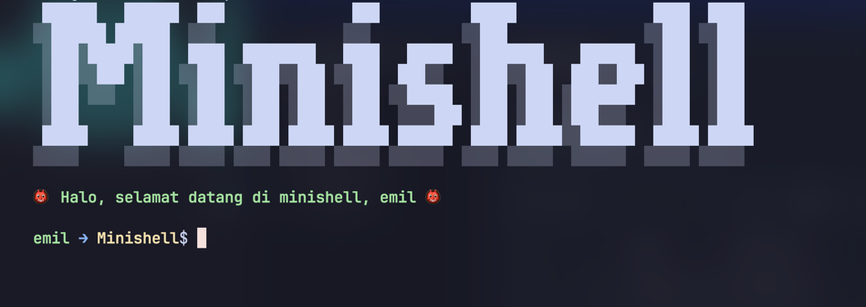

<div align="center">
    
    <p>Score: 125/100</p>
</div>


# Minishell
*This project is an introduction to the world of Unix system programming.*

The objective of this project is for you to create a simple shell. Yes, your own little bash. You will learn a lot about processes and file descriptors.

## Usage
```bash
make
./minishell
```



## Features
- [x] Prompt display
- [x] Command execution
- [x] Environment variables
- [x] Signal handling (`Ctrl-C`, `Ctrl-D`, `Ctrl-\\`)
- Built-in commands:
  - [x] `pwd`
  - [x] `echo [-n] [string ...]`
  - [x] `cd with oldpwd support`
  - [x] `export support for += and without value`
  - [x] `unset`
  - [x] `env`
  - [x] `exit [status]`
- [x] Pipes `|`
- [x] Redirections `>`, `>>`, `<` and `<<`
- [x] Logical operators `&&` and `||`
- [x] Parentheses `()` for logical operators and pipes
- expansion
  - [x] `~`
  - [x] `$?`
  - [x] `$`
  - [x] `""`
  - [x] `''`
  - [x] wildcards expansion (`*`, `?`)
  - [x] unescaped characters (`\`, `\n`)
  - [x] Support of non_interactive / interactive mode
  - [x] Execute commands through the Arguments
  - [x] Working directory and `$PATH` management
  - [x] Support of multiple commands separated by `;`
## Debug
```bash
make debug
```
    